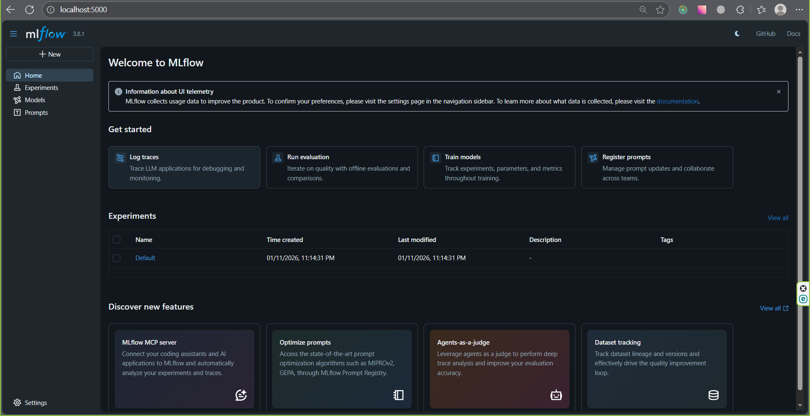
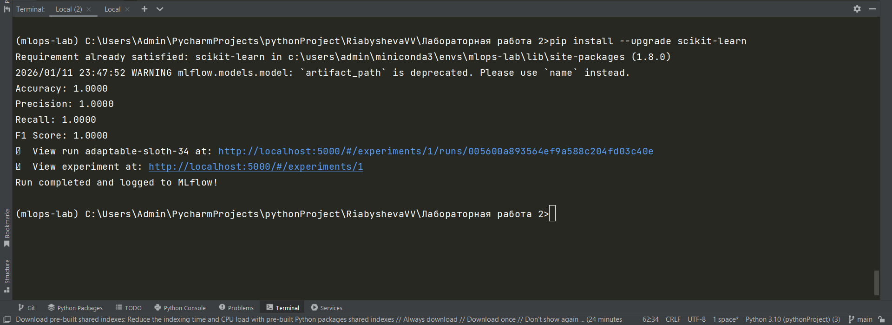
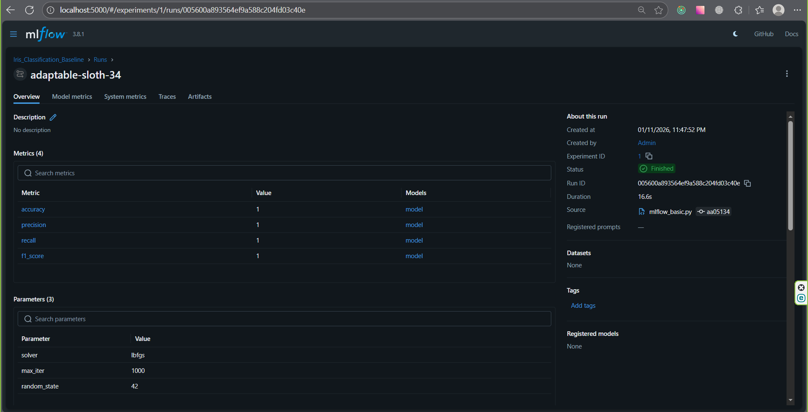

c# Отчет по лабораторной работе №1, Часть 2: 

дисциплина: "Технологии программирования" <br>
**Выполнила:** Рябышева Вероника Валерьевна <br>
группа: ПИН-м-о-24-1 <br>
специальность: 09.03.03 Прикладная информатика <br>

**Преподаватель:** Щеголев Алексей Алексеевич <br>
старший преподаватель департамента цифровых, робототехнических систем и электроники института перспективной инженерии

# Цель работы 
Изучить основные возможности платформы MLflow для управления жизненным циклом проектов машинного обучения (MLOps). Приобрести практический опыт записи параметров, метрик и артефактов экспериментов, а также навыки их систематизации, визуализации и сравнения результатов.

# Ход выполнения работы

Этап 1: Установка MLflow и запуск Tracking Server
**1. Активация окружения и установка пакетов:**

Активируем окружение командой ```conda activate mlops-lab```

Установиваем библиотеку mlflow,используя команду:
```pip install mlflow```

**2. Запуск MLflow Tracking Server:** <br>

В терминале вводим команду ```mlflow server --backend-store-uri sqlite:///mlflow.db --default-artifact-root ./mlruns --host 0.0.0.0 --port 5000``` и запускаем сервер

В итоге, наблюдаем интерфейс MLflow UI с списком
экспериментов



**Этап 2: Написание и запуск скрипта с трекингом эксперимента**
**1. Создадим Python-скрипт:**
Создим файл mlflow_basic.py и скопируем в него код из задания лабораторной работы и реализуем простое обучение модели
логистической регрессии на встроенном в sklearn наборе данных Iris.

Далее откроем второе окно терминала, перейдем в папку с mlflow_basic.py и выполним команду ```python mlflow_basic.py```. 
В консоли видим рассчитанные метрики и сообщение об успешном
завершении




**Этап 3: Анализ результатов в MLflow UI**

Откроем UI, перейдя по адресу http://localhost:5000. Найдем свой эксперимент Iris_Classification_Baseline. Вы увидите список запусков (в данном случае один). 
Изучим детали запуска.


**4. Сравнение запусков:**
Запустим скрипт с измененным параметром ```"solver": "liblinear"```

# Выводы

В ходе выполнения лабораторной работы были достигнуты поставленные цели:

- Изучены основные возможности платформы MLflow для управления жизненным циклом проектов машинного обучения (MLOps).
- Получен практический опыт установки MLflow, запуска Tracking Server и работы с интерфейсом MLflow UI.
- Отработаны навыки логирования параметров, метрик и артефактов эксперимента, включая их систематизацию и визуализацию.
- Реализован пример трекинга эксперимента с использованием Python и sklearn на наборе данных Iris, что позволило наблюдать и анализировать результаты модели через MLflow UI.
- Получено понимание того, как организовать хранение экспериментов и их результатов, а также как использовать MLflow для последующего сравнения различных запусков моделей.

В результате работы сформированы базовые навыки, необходимые для управления и мониторинга экспериментов машинного обучения в рамках MLOps-практик.
